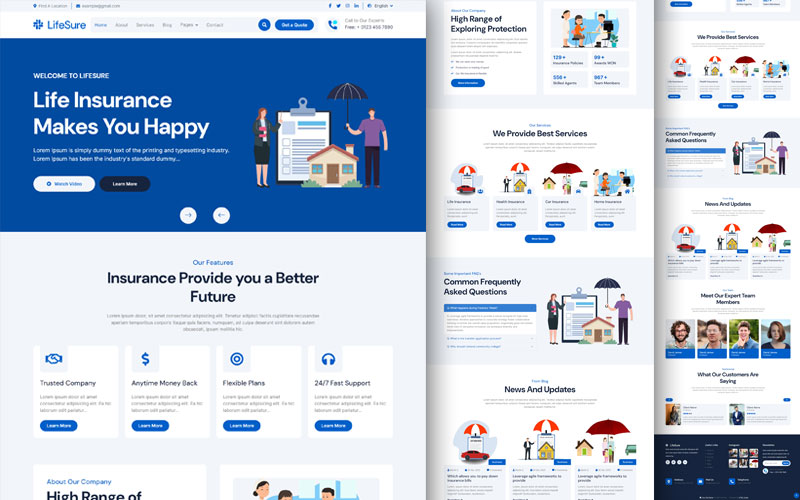

# LifeSure Website Template

LifeSure is a modern and responsive website template designed for life insurance companies. This template is built with HTML, CSS, and JavaScript, and it includes a variety of features and components to help you create a professional and user-friendly website.

## Features

- Responsive Design: The template is fully responsive and works seamlessly on all devices, including desktops, tablets, and mobile phones.
- Bootstrap Framework: Built with the latest version of Bootstrap, ensuring a consistent and modern design.
Customizable: Easily customize the template to match your brand's colors and styles.
- Pre-built Pages: Includes multiple pre-built pages such as Home, About, Services, Blog, Contact, FAQ, Team, and Testimonials.
- JavaScript Libraries: Utilizes popular JavaScript libraries like jQuery, WOW.js, Easing.js, Waypoints, CounterUp, Lightbox, and OwlCarousel for enhanced functionality and animations.
- Google Fonts: Integrated with Google Fonts for beautiful typography.
- Font Awesome Icons: Includes Font Awesome icons for easy use of scalable vector icons.

## UI

